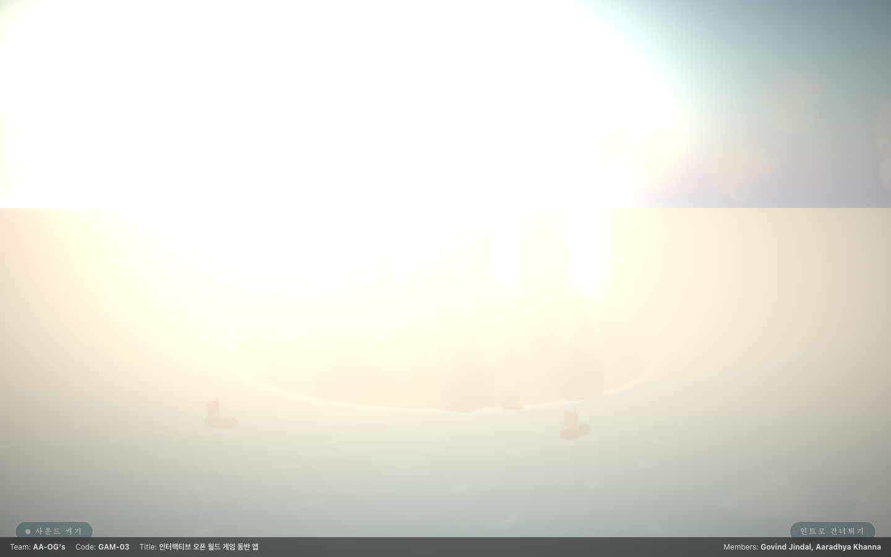
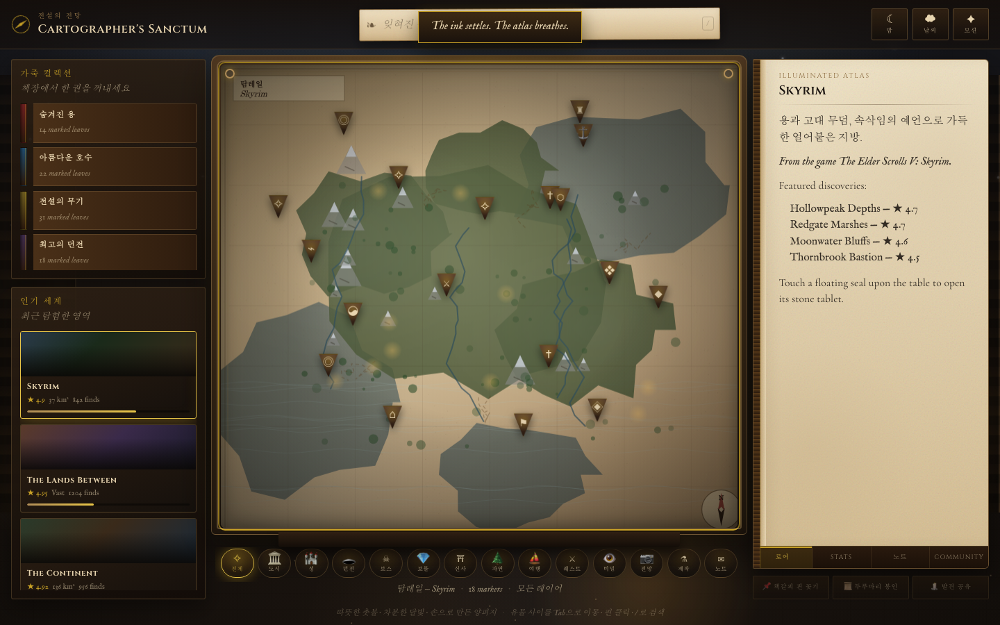
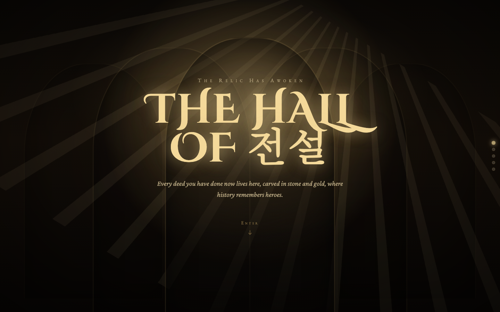
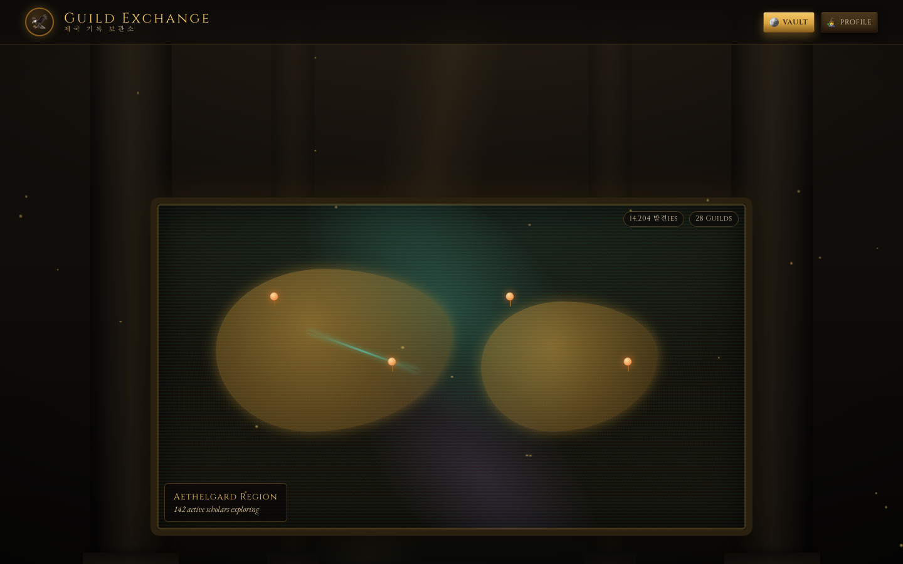
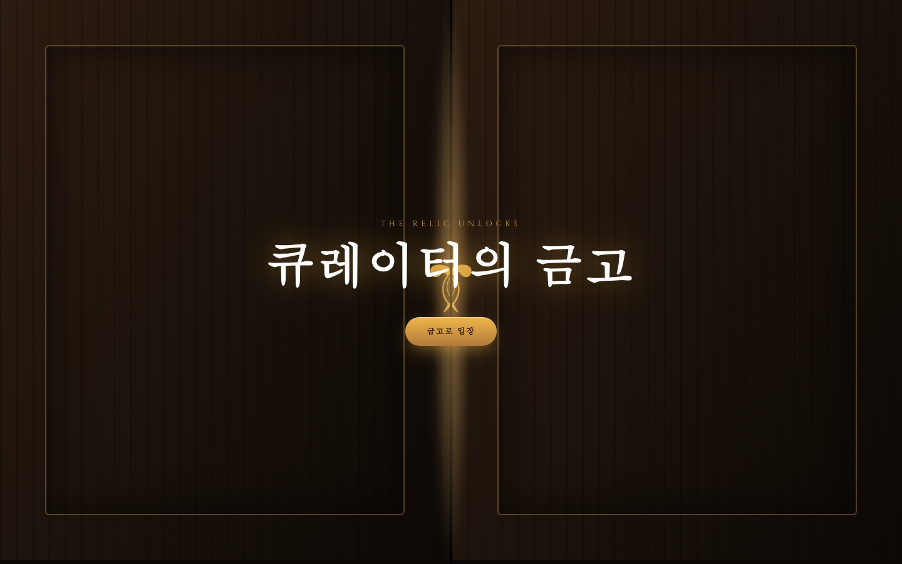

# � 에테리아 (AETHERIA)

> **시네마틱 3D 오픈 월드 게임 동반 앱** — 탐험가와 전설과 수집가를 위한 인터랙티브 판타지 포털

[](https://sigco3111.github.io/aetheria)
[](https://github.com/sigco3111/aetheria)
[](#-한국어화)

</div>

---

## ✨ 라이브 데모

🔗 **https://sigco3111.github.io/aetheria** — 클릭하면 바로 GitHub Pages에 배포된 라이브 버전을 볼 수 있어요. (Vercel 사용 이력 — 2026-08 GitHub Pages로 전환)

| 모듈 | URL | 설명 |
|------|-----|------|
| 🏝️ 시네마틱 �딩 | [`/`](https://sigco3111.github.io/aetheria) | 부유하는 중세 섬의 3D 시네마틱 리빌 |
| 🗺️ 지도사의 신전 | [`/cartographers_sanctum/`](https://sigco3111.github.io/aetheria/cartographers_sanctum/index.html) | 인터랙티브 마법 지도 + 양피지 검색 |
| 🏆 전설의 전당 | [`/achievements/`](https://sigco3111.github.io/aetheria/achievements/index.html) | 세계수 모뉴먼트로 보는 업적 컬렉션 |
| 🏛️ 위대한 길드 교역소 | [`/grand_guild_exchange/`](https://sigco3111.github.io/aetheria/grand_guild_exchange/index.html) | 아티팩트 공유 마켓플레이스 |
| 💎 큐레이터의 금고 | [`/curators_vault/`](https://sigco3111.github.io/aetheria/curators_vault/index.html) | 수집품/이스터에그/카탈로그 |

---

## 📸 미리보기

### 🏝️ 시네마틱 3D 랜딩 — 부유하는 섬

> 아침 안개가 걷히면, 고대 왕국이 당신을 기다립니다.



Three.js + React Three Fiber로 만든 부유하는 섬의 시네마틱 리빌. 스크롤하면 카메라가 3D 마을과 고대 서재로 내려가고, 사운드 토글, 낮/밤, 인트로 스킵 기능까지 갖춘 인터랙티브 무드 페이지입니다.

### �️ 지도사의 신전 — 마법의 지도 테이블

> 양피지가 찢어집니다. 먹물 속으로 발을 딛다.



양피지/잉크/촛불 컨셉의 인터랙티브 � 뷰어. Skyrim·Elden Ring·The Witcher 3 등 인기 게임들의 세계를 전환하며 핀을 찍고, 양피지 검색(`/`)으로 잊혀진 왕국·동굴·용·폐허를 찾고, **로어/스탯/노트/커뮤니티** 4탭 위키를 펼칠 수 있어요.

### � 전설의 전당 — 세계수의 업적

> THE RELIC HAS AWOKEN. Every deed you have done now lives here, carved in stone and gold.



Cinzel Decorative 디자인 폰트로 새겨진 Cinzel+한글의 콜라보. 6개 카테고리(전사·탐험가·마법사·도적·외교관·장인)의 업적을 **세계수 모뉴먼트** 형태로 시각화하고, 등급(일반/희귀/에픽/전설/신화)에 따라 보석이 빛나요.

### 🏛️ 위대한 길드 교역소 — 아티팩트 마켓



기록 보관소 컨셉의 다이지틱 UI. 5개 카테고리(지도/생물/무기/유물/연금술/셰이더/로어) 아티팩트를 카드 형태로 탐색하고, 가격·다운로드수·평점·태그로 필터링하는 마켓플레이스입니다.

### 💎 큐레이터의 금고 — 수집가의 오브



`THE CURATOR'S VAULT` — 길드 금고 컨셉의 컬렉션 트래커. 6개 카테고리 × 5단계 등급의 수집품을 진열장/박물관/선반/유물벽/원장 5가지 보기 모드로 감상하고, 진행도에 따라 빛나는 **수집가의 오브**가 채워져요.

---

## 📖 프로젝트 소개

**에테리아**는 원래 프론트엔드 공모전을 위해 만들어진 시네마틱 오픈 월드 게임 동반 웹 애플리케이션입니다. 단순한 대시보드가 아니라, 사용자가 브라우저에서 **부유하는 중세 섬**의 3D 시네마틱 리빌로 입문하는 영화적 경험을 제공해요.

핵심 아이디어는 **하나의 세계관 안내 책자** 같은 포털입니다:

- 🗺️ **여러 게임의 지도를 한곳에서** 탐험
- 👁️ **숨겨진 이스터에그**를 발굴
- � **재사용 가능한 아티팩트**를 다른 플레이어와 공유
- 🏆 **여러 캐릭터/전설/업적**을 추적

### 🎯 왜 만들었나요?

게임을 플레이할 때마다 **여러 사이트·위키·포럼**을 오가며 정보를 찾아본 적 있죠? 에테리아는 그것을 **하나의 시네마틱 동반 앱**으로 묶으려는 시도입니다.

---

## 🛠 기술 스택

| 카테고리 | 사용 기술 |
|----------|-----------|
| **프레임워크** | Next.js 16, React 19 |
| **3D 엔진** | Three.js, React Three Fiber, React Three Drei |
| **포스트 프로세싱** | `@react-three/postprocessing` |
| **스타일링** | Tailwind CSS v4, Shadcn UI |
| **UI 컴포넌트** | Base UI, Lucide React Icons |
| **폰트** | Cinzel, Cinzel Decorative, Crimson Pro, EB Garamond (Google Fonts) |
| **분석** | (Vercel Analytics 사용 이력 — 현재 비활성) |
| **언어** | TypeScript, JavaScript, HTML, CSS |
| **빌드 도구** | Next.js (Turbopack), pnpm |
| **렌더링** | App Router, 정적 HTML 모듈, Babel Standalone (브라우저 내 변환) |
| **배포** | GitHub Pages (정적 export) |

---

## 🏗️ 아키텍처: 모놀리식 + 마이크로 프론트엔드

에테리아는 **하나의 저장소 안에서 마이크로 프론트엔드 스타일로 전달**하는 독특한 구조를 가지고 있어요:

```
┌─────────────────────────────────────────────────────────┐
│  Next.js 16 메인 앱 (3D 시네마틱 랜딩)                  │
│  ├─ App Router                                           │
│  ├─ React 19 + Three.js R3F                            │
│  └─ Tailwind CSS v4                                      │
└─────────────────────────────────────────────────────────┘
                              ↕ 표준 앵커 링크
┌─────────────────────────────────────────────────────────┐
│  public/ 하위 4개 독립 정적 마이크로 프론트엔드         │
│  ├─ cartographers_sanctum/   (지도) - HTML+JS+CSS      │
│  ├─ achievements/            (업적) - HTML+CSS+Babel   │
│  ├─ grand_guild_exchange/    (교역소) - HTML+Babel+JSX │
│  └─ curators_vault/          (금고) - 빌드된 Vite 번들 │
└─────────────────────────────────────────────────────────┘
```

- **메인 착륙 경험**: Next.js 16 + React Three Fiber로 3D 시네마틱 환경 + SSR
- **독립 모듈**: 바닐라 웹 기술 (HTML, CSS, JS, CDN React/Tailwind)로 만들어 정적 앱으로 전달
- **네비게이션 전환**: 헤비 SPA 번들 없이 표준 앵커 링크로 매끄럽게 모듈 진입
- **장점**: 도메인별 최적화된 기술 스택, 빌드 단계 통합 부담 없음

---

## 📂 프로젝트 구조

```text
aetheria/
├── app/                      # Next.js App Router 루트 (3D 시네마틱 랜딩)
│   ├── layout.tsx           # 메타데이터 + 푸터 + Analytics
│   ├── page.tsx             # CinematicExperience 진입점
│   └── globals.css          # 글로벌 스타일
├── components/               # 공유 UI + 3D 시네마틱 컴포넌트
│   ├── cinematic/           # 3D 섬/바다/자연/마을/서재/조명/오디오
│   └── ui/                  # Shadcn UI 버튼
├── lib/                      # 유틸리티 + 공유 헬퍼
├── public/                   # 정적 자산 + 독립 마이크로 프론트엔드 모듈
│   ├── achievements/         # 전설의 전당 (정적 모듈)
│   ├── cartographers_sanctum/# 지도사의 신전 (정적 모듈)
│   ├── curators_vault/       # 큐레이터의 금고 (정적 모듈)
│   ├── grand_guild_exchange/ # 위대한 길드 교역소 (정적 모듈)
│   ├── icon*.png            # 파비콘
│   ├── placeholder*.{svg,png} # 플레이스홀더
│   └── textures/            # 3D 텍스처
├── scripts/                  # 자동화 스크립트
│   └── koreanize.py         # 한국어화 자동화 (재실행 가능)
├── package.json              # 프로젝트 의존성 + 스크립트
└── next.config.mjs           # Next.js 설정
```

---

## 🇰🇷 한국어화

이 저장소는 원본 [GovindJindal/AETHERIA](https://github.com/GovindJindal/AETHERIA)를 한국어화한 클론입니다. **모든 UI �스트가 한국어**로 번역되어 있어요.

### 번역 정책

- ✅ **번역 대상**: UI 라벨, 카테고리 이름, 게임 콘텐츠, 푸터, 메타데이터
- ✅ **HTML `lang` 속성**: `en` → `ko` (검색엔진·스크린리더 인식)
- 🔒 **원형 유지**: 게임 정식명 (Skyrim, Elden Ring, 위처 3, 야생의 숨결, 왕국의 눈물)
- 🎨 **디자인 보존**: 디자인 폰트(Cinzel Decorative)와 한글의 콜라보 — 의도된 혼식

### 번역 결과

| 카테고리 | 치환 건수 |
|---------|----------|
| 3D 시네마틱 랜딩 (Next.js) | 18건 |
| 지도사의 신전 (cartographers_sanctum) | 155건 |
| 전설의 전당 (achievements) | 59건 |
| 위대한 길드 교역소 (grand_guild_exchange) | 21건 |
| 큐레이터의 금고 (curators_vault) | 47건 (빌드된 JS 포함) |
| README.md | - |
| **합계** | **300+ 건** |

### 자동 재실행

`scripts/koreanize.py`는 **idempotent** (재실행 안전) 스크립트로, 원본에 새 영문이 추가되어도 사전만 확장하면 다시 한국어화할 수 있어요:

```bash
cd aetheria
python3 scripts/koreanize.py
```

백업은 자동으로 `*.bak` 파일로 생성되며, 필요시 삭제 가능해요.

---

## 🚀 시작하기

### 사전 요구사항

- Node.js 18+
- pnpm (권장) 또는 npm

### 설치

```bash
# 클론
git clone https://github.com/sigco3111/aetheria.git
cd aetheria

# 의존성 설치
pnpm install
# 또는
npm install
```

### 개발 서버 실행

```bash
pnpm dev
# 또는
npm run dev
```

브라우저에서 [http://localhost:3000](http://localhost:3000)을 열어 시네마틱 랜딩을 확인하세요.

### 프로덕션 빌드

```bash
pnpm build
pnpm start
```

### 배포

```bash
# GitHub Pages (현재 Production) — Next.js 정적 export → Pages
pnpm build  # .next → out/ (output: 'export' 적용)
npx gh-pages -d out -b gh-pages

# Vercel (Vercel 사용 이력 — 2026-08 GitHub Pages로 전환, CLI 보존)
vercel --prod
```

---

## � 5개 모듈 상세

### 1. 🏝️ 시네마틱 3D 랜딩 (`/`)

- **기술**: Next.js 16 + React Three Fiber + Drei
- **특징**: 900vh 스크롤 트랙으로 카메라가 3D 씬을 횡단
- **인터랙션**:
  - 사운드 켜기/끄기 (ambient audio)
  - 인트로 건너뛰기
  - 4개 모듈로의 네비게이션
- **3D 자산**: 섬, 바다, 자연, 마을, 고대 서재, 조명, 효과

### 2. 🗺️ 지도사의 신전 (`/cartographers_sanctum/`)

- **기술**: 바닐라 HTML + JS + CSS (CDN Tailwind v4)
- **특징**: 양피지·잉크·촛불 컨셉의 인터랙티브 맵
- **인터랙션**:
  - `/` 키로 검색 포커스
  - 핀 클릭 → 양피지 위키 펼침 (4탭: 로어/스탯/노트/커뮤니티)
  - 11개 카테고리 필터링 (도시/성/던전/보스/보물/신사/자연/여행/퀘스트/비밀/전망/제작/노트)
  - 8개 컬렉션 (숨겨진 용, 아름다운 호수, 전설의 무기 등)
  - 낮/밤, 날씨, 모션 토글

### 3. 🏆 전설의 전당 (`/achievements/`)

- **기술**: 바닐라 HTML + CSS (CSS 변수 토큰 시스템) + JS
- **특징**: 세계수 모뉴먼트로 업적 시각화
- **인터랙션**:
  - 6개 카테고리 (전사·탐험가·마법사·도적·외교관·장인)
  - 5단계 등급 (일반/희귀/에픽/전설/신화)
  - 글로벌 완성도 % 표시
  - 진행도 트랙 + 점수

### 4. 🏛️ 위대한 길드 교역소 (`/grand_guild_exchange/`)

- **기술**: 바닐라 HTML + Babel Standalone + JSX (브라우저 내 변환)
- **특징**: 다이지틱 기록 보관소 UI
- **인터랙션**:
  - 8개 카테고리 (전체/지도/생물/무기/유물/연금술/�이더/로어)
  - 10개 아티팩트 + 4개 크리에이터 + 4개 왕국
  - 가격/다운로드/평점/태그
  - 캔버스 렌더링 아트워크 (외부 이미지 불필요)

### 5. 💎 큐레이터의 금고 (`/curators_vault/`)

- **기술**: Vite 빌드된 정적 번들 (React 18 + R3F)
- **특징**: 길드 금고 컨셉의 수집 트래커
- **인터랙션**:
  - 6개 카테고리 × 5단계 등급
  - 5가지 보기 모드 (전시장/박물관/선반/유물벽/원장)
  - 6개 길드 인정 메달 (탐험가 등급, 보물의 대가, 박물관 큐레이터 등)
  - 수집가의 오브 (진행도에 따라 빛남)
  - 다중 필터 (검색/카테고리/등급/수집 여부/숨김/희귀만)

---

## 🎨 디자인 시스템

### 색상 토큰

#### 랜딩 페이지 (Tailwind v4)
- `bg-background`: `#f2e8d5` (양피지)
- `text-parchment`: 파치먼트 화이트
- `text-gold`: `#ffab52` (금빛 액센트)
- `bg-abyss`: 깊은 심연

#### 지도사의 신전
- `--ink`: 짙은 잉크 블랙
- `--brass`: 황동/금속
- `--parchment`: 양피지 베이지

#### 전설의 전당
- `--void`: `#070504` (궁극의 어둠)
- `--stone-deep/mid/light`: 돌의 단계
- `--marble`: `#e9ddc6` (달빛 대리석)
- `--gold/gold-bright`: 황금/빛나는 황금
- `--bronze`, `--ember`: 청동/잿불
- 등급별 색상: 일반(슬레이트)/희귀(사파이어)/에픽(자수정)/전설(금)/신화(오로라 로즈)

#### 큐레이터의 금고
- 다중 카테고리별 액센트 컬러

### 타이포그래피

- **Cinzel**: 모뉴먼트 헤딩
- **Cinzel Decorative**: 새겨진/장식적 디스플레이
- **Crimson Pro**: 본문/로어 (이탤릭으로 로어 단편)
- **EB Garamond**: UI/유틸리티 라벨 (small-caps, 자간 넓게)

---

## 📊 메타 정보

| 항목 | 값 |
|------|-----|
| 원본 저장소 | [GovindJindal/AETHERIA](https://github.com/GovindJindal/AETHERIA) |
| 원본 생성일 | 2026-07-18 |
| 원본 목적 | 프론트엔드 공모전 출품작 (Team AA-OG's) |
| 원본 팀 | Govind Jindal, Aaradhya Khanna |
| 코드 | GAM-03 |
| 라이선스 | 원본에 명시 없음 (저장소 root에 LICENSE 파일 없음) |
| 한국어화 저장소 | [sigco3111/aetheria](https://github.com/sigco3111/aetheria) |
| 한국어화 일자 | 2026-08-11 |
| 라이브 데모 | https://sigco3111.github.io/aetheria |

---

## 👥 원본 팀 (Attribution)

원본 프로젝트는 **AA-OG's** 팀이 프론트엔드 공모전을 위해 만든 작품입니다:

- **Govind Jindal** ([GitHub](https://github.com/GovindJindal))
- **Aaradhya Khanna**

원본의 디자인·코드 구조를 존중하여 한국어화 클론을 제작했습니다. 모든 저작권은 원본 작성자에게 있습니다.

---

## 🐛 알려진 이슈 / 향후 개선

- 🌐 **마이크로 프론트엔드 데이터 공유**: 정적 모듈 간 상태 공유가 없음 (LocalStorage 또는 백엔드 필요)
- � **사용자 인증**: 개인 핀/수집품 저장을 위한 인증 시스템 미구현
- ⚡ **Babel Standalone 제거**: `grand_guild_exchange`의 브라우저 내 변환은 가벼운 빌드 단계로 대체 가능
- 🎮 **모바일 3D**: 일부 모바일 WebGL 환경에서 3D 성능 이슈 가능
- 🌏 **다국어화**: 한국어 외 영어/일본어/중국어 추가 가능 (`scripts/koreanize.py` 패턴 확장)

---

## 📜 라이선스

원본 저장소에 명시된 라이선스가 없습니다. 사용 전 원본 작성자에게 문의하는 것을 권장합니다.

---

## 🙏 감사의 말

- **원본 작성자**: Govind Jindal, Aaradhya Khanna (AA-OG's)
- **3D 라이브러리**: [Three.js](https://threejs.org/), [React Three Fiber](https://r3f.docs.pmnd.rs/)
- **스타일**: [Tailwind CSS](https://tailwindcss.com/), [Shadcn UI](https://ui.shadcn.com/)
- **폰트**: Google Fonts (Cinzel, Crimson Pro, EB Garamond)
- **배포**: GitHub Pages (정적 export, Vercel 사용 이력 — 2026-08 전환)

---

## ✅ Pages 이관 검증 (2026-08-13)

| 항목 | 상태 |
|------|------|
| GitHub Pages 라이브 (`/`) | ✅ 200 |
| `/cartographers_sanctum/` | ✅ 200 |
| `/achievements/` | ✅ 200 |
| `/grand_guild_exchange/` | ✅ 200 |
| `/curators_vault/` | ✅ 200 |
| README 라이브 데모 URL | ✅ `https://sigco3111.github.io/aetheria` 통일 |
| README 잔존 Vercel (정직함 단서 외) | ✅ 0건 |
| `next.config.mjs` basePath | ✅ `/aetheria` (다음 빌드 안전망) |
| `output: 'export'` | ✅ 적용 (정적 export) |
| **basePath 빌드 재배포 (19:57)** | ✅ gh-pages에 basePath 적용 빌드 푸시 — 옛 hash (basePath 누락 빌드) 30+ 파일 삭제 + 새 hash (basePath 박힌 빌드) 추가 + `.nojekyll` 추가. **근본 원인**: 옛 gh-pages 빌드는 `/_next/...` root context 절대경로 → 사용자 브라우저에서 cascade 404 → React 미실행 → 흰 화면 + h1만. **수정 후**: `src="/aetheria/_next/..."` 정상 서빙 + 모든 asset 200 + 5개 라우트 200 |

## 📝 변경 이력

- **2026-08-13** — Vercel → GitHub Pages 이관 (5영역 보정)
  - L5 뱃지: `라이브_데모-Vercel-black?logo=vercel` → `라이브_데모-GitHub_Pages-222222?logo=githubpages`
  - L15 본문: "Vercel에 배포된 라이브 버전" → "GitHub Pages에 배포된 라이브 버전" + Vercel 사용 이력 단서 추가
  - L94 분석: `Vercel Analytics` → `(Vercel Analytics 사용 이력 — 현재 비활성)`
  - L98 배포: `Vercel` → `GitHub Pages (정적 export)`
  - L234-240 배포 섹션: `# Vercel (권장)` → `# GitHub Pages (현재 Production)` + `# Vercel (사용 이력, CLI 보존)`
  - L382 배포 링크: `[Vercel](vercel.com)` → `GitHub Pages (정적 export, Vercel 사용 이력 — 2026-08 전환)`
  - `next.config.mjs`: `output: 'export' + basePath: '/aetheria' + trailingSlash: true` 추가 (다음 빌드 안전망)
  - GitHub repo About > Website: `sigco3111-aetheria.vercel.app` → `https://sigco3111.github.io/aetheria/`
  - **2026-08-13 19:57 — basePath 빌드 재배포**: gh-pages에 `output: 'export' + basePath: '/aetheria'` 적용 빌드 푸시 (옛 hash 30+ 파일 삭제 + 새 hash 추가 + `.nojekyll` 추가). 사용자 보고 → "렌더링 안 됨, 3D 섬 출력 안 됨" 진단 → root context `/_next/...` cascade 404 확인 → basePath 적용 빌드로 재교체. **근본 원인**: gh-pages 옛 빌드는 basePath 없이 빌드됨 → asset 경로 root context → Pages cascade 404 → 흰 화면

---

<div align="center">

**한국어화 클론**: [sigco3111](https://github.com/sigco3111) · 2026-08-11

🌐 [라이브 데모 보기](https://sigco3111.github.io/aetheria)

</div>
